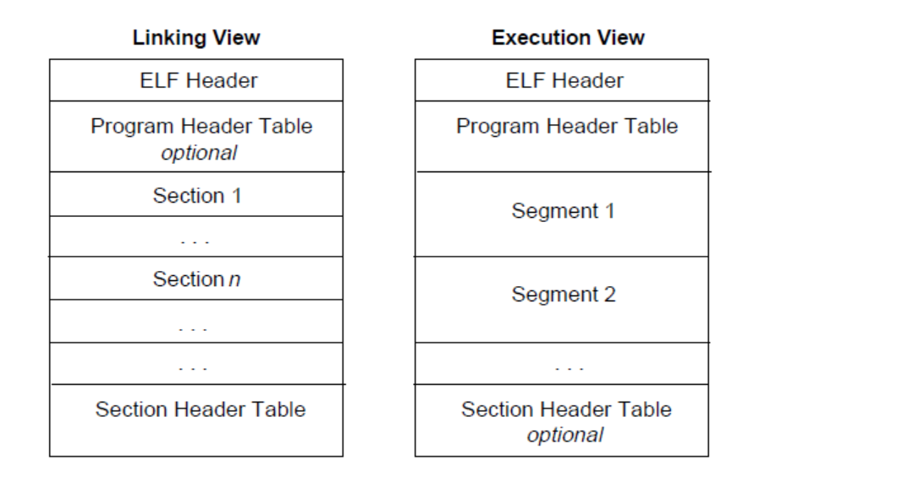
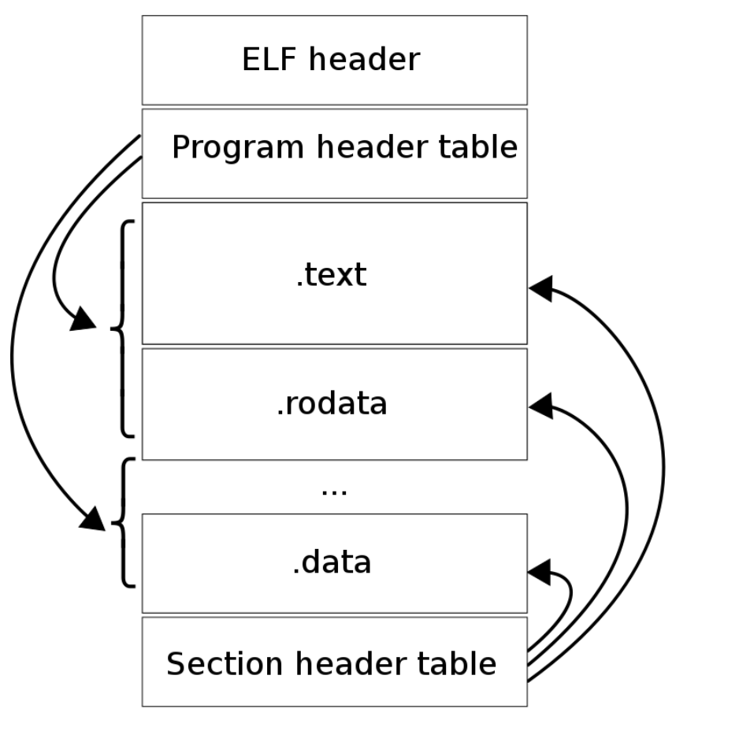

# ELF 文件格式

ELF (Executable and Linkable Format) 是一种常见的可执行文件格式，广泛用于UNIX和类UNIX系统中。它定义了可执行文件、共享库、目标文件等的结构和布局。
- 头部段（Header Segment）：包含有关文件的基本信息，如文件类型、入口点地址、机器架构等。
- 程序头表段（Program Header Table Segment）：描述了可执行文件中各个程序段的属性和位置，用于加载和执行程序。
- 节区头表段（Section Header Table Segment）：描述了文件中所包含的各个节区的属性和位置，用于链接和调试程序。
- 代码段（Code Segment）：存放程序的机器代码，包括可执行代码和只读数据。
- 数据段（Data Segment）：存放程序的读写数据。
- 符号表段（Symbol Table Segment）：存放程序中的符号信息，用于链接和调试。
- 字符串表段（String Table Segment）：存放各个段和节区的名称等字符串信息。




## ELF

[相关源码](https://elixir.bootlin.com/glibc/latest/source/elf/elf.h)

### elf header

```cpp
typedef struct
{
  unsigned char	e_ident[EI_NIDENT];	    // magic number 
  Elf64_Half	e_type;			        // 比如 可重定位文件 和 可执行文件
  Elf64_Half	e_machine;		        // CPU架构，比如x86
  Elf64_Word	e_version;		        // 版本
  Elf64_Addr	e_entry;		        // 程序入口点
  Elf64_Off	    e_phoff;		        // 表示程序头表（Program Header Table）的偏移量
  Elf64_Off	    e_shoff;		        // 用于表示节区头表（Section Header Table）的偏移量
  Elf64_Word	e_flags;		        // 表示与目标文件相关的标志或特性
  Elf64_Half	e_ehsize;		        // 表示ELF头部的大小
  Elf64_Half	e_phentsize;		    // 用于表示程序头表的表项大小
  Elf64_Half	e_phnum;		        // 表示程序头表（Program Header Table）中的表项数量
  Elf64_Half	e_shentsize;		    // section
  Elf64_Half	e_shnum;		        
  Elf64_Half	e_shstrndx;		        
} Elf64_Ehdr;
```

### e_ident 

16位标识，elf开头16字节
- EI_MAG0：文件标识 0x7f
- EI_MAG1：文件标识 E
- EI_MAG2：文件标识 L
- EI_MAG3：文件标识 F
- EI_CLASS：文件类别 ELF64: 0x2
- EI_DATA：编码格式，选用小端编码
- EI_VERSION：文件版本，一般情况下，该位置对应的数值是 1
- EI_OSABI：OS ABI 识别标志，值为 0：指明 UNIX System V ABI
- EI_ABIVERSION：ABI 版本，该位置一般值为零
- EI_PAD：补充字节开始的地址，这些字节被保留并设置为零

```cpp
// EI_CLASS
#define EI_CLASS	    4		/* File class byte index */
#define ELFCLASSNONE	0		/* Invalid class */
#define ELFCLASS32	    1		/* 32-bit objects */
#define ELFCLASS64	    2		/* 64-bit objects */
#define ELFCLASSNUM	    3

// EI_DATA
#define EI_DATA		5		/* Data encoding byte index */
#define ELFDATANONE	0		/* Invalid data encoding */
#define ELFDATA2LSB	1		/* 2's complement, little endian 补码编码（2's complement）且为小端编码 */
#define ELFDATA2MSB	2		/* 2's complement, big endian */
#define ELFDATANUM	3
``` 

### etype

值为 2：可执行文件；

### e_machine

x86_64
```cpp
#define EM_X86_64	62	         /* AMD x86-64 architecture */
```

### e_version

```cpp
/* Legal values for e_version (version).  */

#define EV_NONE		0		 /* Invalid ELF version */
#define EV_CURRENT	1		 /* Current version */
#define EV_NUM		2
```

### e_entry

此字段（64 位 ELF 文件是 8 字节）指明程序入口的虚拟地址。即当文件被加载到进程空间里后，入口程序在进程地址空间里的地址。

### pheader, section

e_phoff（ELF Header-Program Header Table Offset）：此字段指明程序头表（program header table）开始处在文件中的偏移量，相对于 ELF 文件初始位置的偏移量。程序头表又称为段头表，程序头表包含这些段的一个总览的信息。如果没有程序头表，该值应设为 0。e_phoff与之后要介绍的e_phentsize和e_phnum这三个成员描述了 ELF 文件中关于程序头表部分的信息，e_phoff：起始地址偏移，程序头表开始的位置；e_phentsize：程序头表中每个表项的大小；e_phnum：表项的数量。

e_shoff（ELF Header-Section Header Table Offset）：指明节头表（section header table）开始处在文件中的偏移量。如果没有节头表，该值应设为 0。与e_shentsize和e_shnum这三个成员描述了 ELF 文件中关于节头表部分的信息，e_shoff：起始地址偏移，节头表开始的位置；e_shentsize：节头表中每个表项的大小；e_shnum：表项的数量。

e_flags（ELF Header-Flags）：此字段（4 字节）含有处理器特定的标志位。对于 Intel 架构的处理器来说，它没有定义任何标志位，所以 e_flags 应该值为 0。

e_shstrndx（ELF Header-Section Header Table String Index）：此字段（2 字节）表明节头表中与节名字表相对应的表项的索引。如果文件没有节名字表，此值应设置为 SHN_UNDE。

## elf pheader

Program segment header: 程序头部表（Program Header Table）存在的话，它会告诉系统如何创建进程。用于生成进程的目标文件必须具有程序头部表，但是重定位文件不需要这个表。
```cpp
/* Program segment header.  */
typedef struct
{
  Elf64_Word	p_type;			/* Segment type */
  Elf64_Word	p_flags;		/* Segment flags */
  Elf64_Off	    p_offset;		/* Segment file offset */
  Elf64_Addr	p_vaddr;		/* Segment virtual address */
  Elf64_Addr	p_paddr;		/* Segment physical address */
  Elf64_Xword	p_filesz;		/* Segment size in file */
  Elf64_Xword	p_memsz;		/* Segment size in memory */
  Elf64_Xword	p_align;		/* Segment alignment */
} Elf64_Phdr;
```

对于执行视图来说，其主要的不同点在于没有了 section，而有了多个 segment。其实这里的 segment 大都是来源于链接视图中的 section。


## elf section header

节区头部表（Section Header Table）包含了描述文件节区的信息，每个节区在表中都有一个表项，会给出节区名称、节区大小等信息。用于链接的目标文件必须有节区头部表，其它目标文件则无所谓，可以有，也可以没有。
```cpp
/* Section header.  */

typedef struct
{
  Elf64_Word	sh_name;	    /* Section name (string tbl index) */    
  Elf64_Word	sh_type;	    /* Section type */                       
  Elf64_Xword	sh_flags;	    /* Section flags */                      
  Elf64_Addr	sh_addr;	    /* Section virtual addr at execution */ 
  Elf64_Off	    sh_offset;	    /* Section file offset */                
  Elf64_Xword	sh_size;	    /* Section size in bytes */
  Elf64_Word	sh_link;	    /* Link to another section */
  Elf64_Word	sh_info;	    /* Additional section information */
  Elf64_Xword	sh_addralign;	 /* Section alignment */
  Elf64_Xword	sh_entsize;	    /* Entry size if section holds table */
} Elf64_Shdr;
```

## reference

- [ctfwiki](https://ctf-wiki.org/executable/elf/structure/basic-info/)